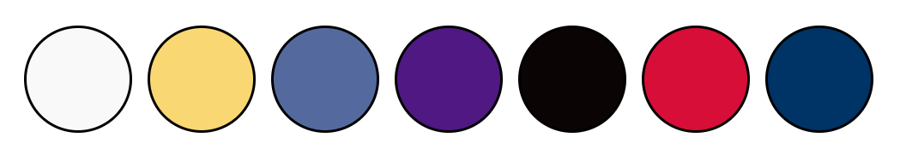
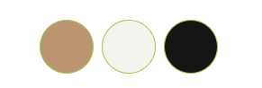

# Frontend (html5, css3, js, bootstrap)

## Assignments 6-10

### Assignment No.6

Assignment No.6 is a simple Html5 only page for a movie. you can visit it here: [https://rezapps.github.io/frontend/Assignment-6/](https://rezapps.github.io/frontend/Assignment-6/)

The page passes Html Checker [Html Checker](https://validator.w3.org/nu/?doc=https%3A%2F%2Frezapps.github.io%2Ffrontend%2FAssignment-6%2F)

### Assignment No.7

Page is using css with flex.
Color palette:

1. minion-white: f9f9f9
2. minion-yellow: f9d773;
3. minion-blue: 546a9f
4. poison: 4f1883;
5. gru-black: 0b0404;
6. gru-red: d70e37;
7. gru-blue: 003366;

Visit the page: [https://rezapps.github.io/frontend/Assignment-7/](https://rezapps.github.io/frontend/Assignment-7/)

### Assignment No.8

Assignment No.8 is a simple page for a coffee company, using bootstrap v5.

Color Palette:

1. primary: BF946F
2. secondary: f3f4ee
3. background: 151515

Visit the page: [https://rezapps.github.io/frontend/Assignment-8/](https://rezapps.github.io/frontend/Assignment-8/)

### Assignment No.9

Assignment No.9 covers JavaScript programming and Dom Manipulation.

1. BishBosh (FizzBuzz)
2. Todo List to add new tasks/items and save them in localstorage. Each task can be marked as complete or get deleted.

Visit the page: [https://rezapps.github.io/frontend/Assignment-9/todo.html](https://rezapps.github.io/frontend/Assignment-9/todo.html)

### Assignment No.10

Assignment No.10 covers API and DOM

Visit the page: [https://rezapps.github.io/frontend/Assignment-10/](https://rezapps.github.io/frontend/Assignment-10/dist/index.html)
